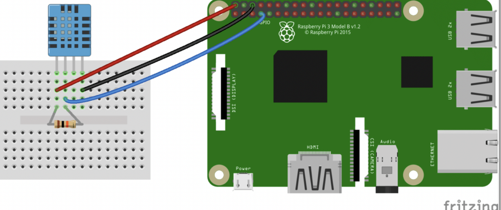
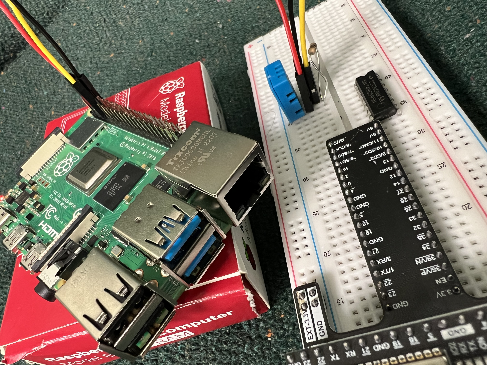
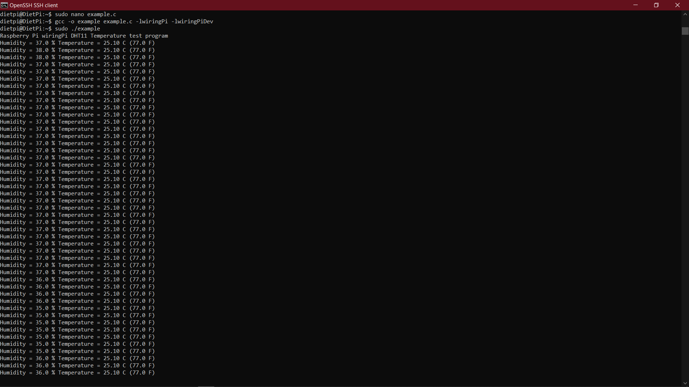
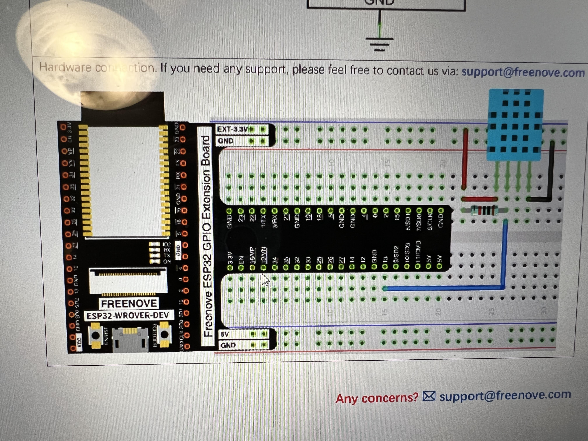
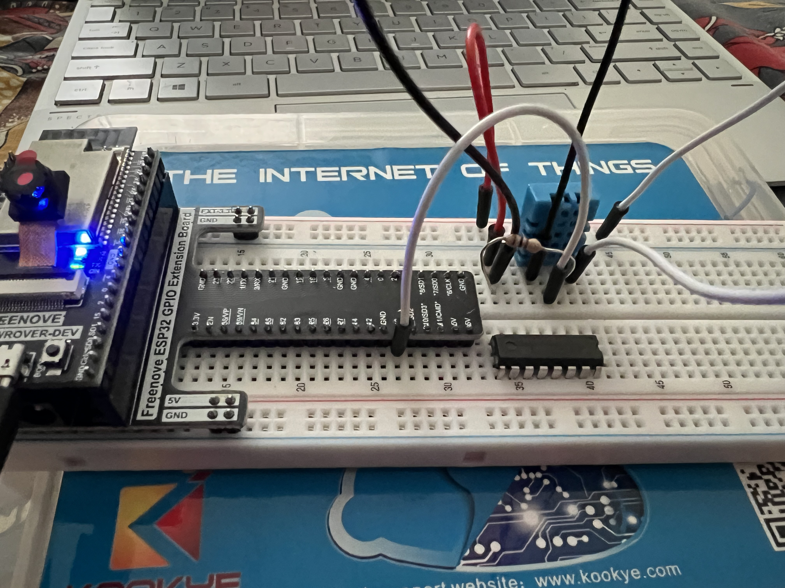
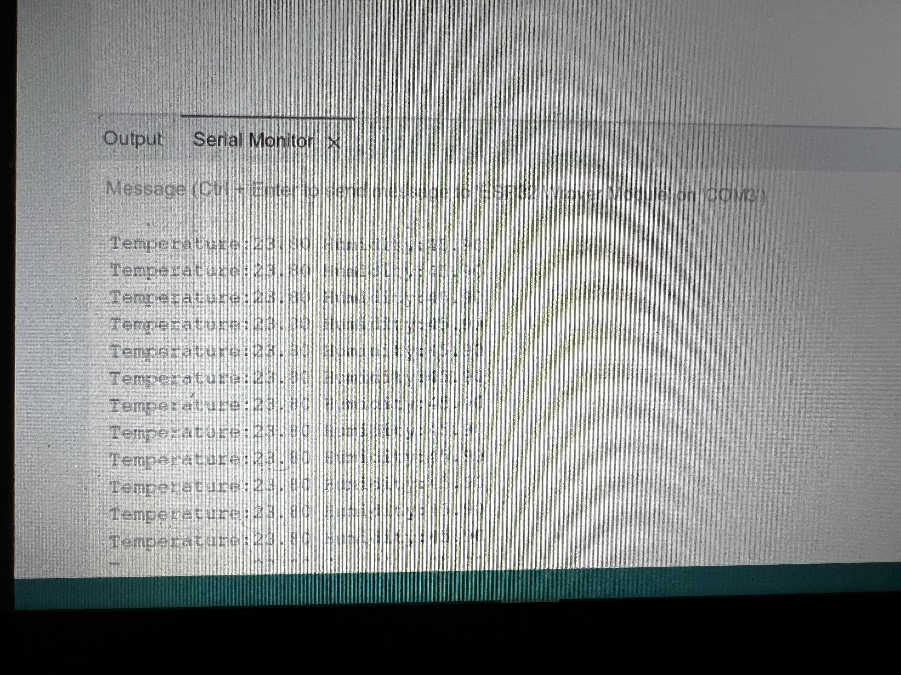
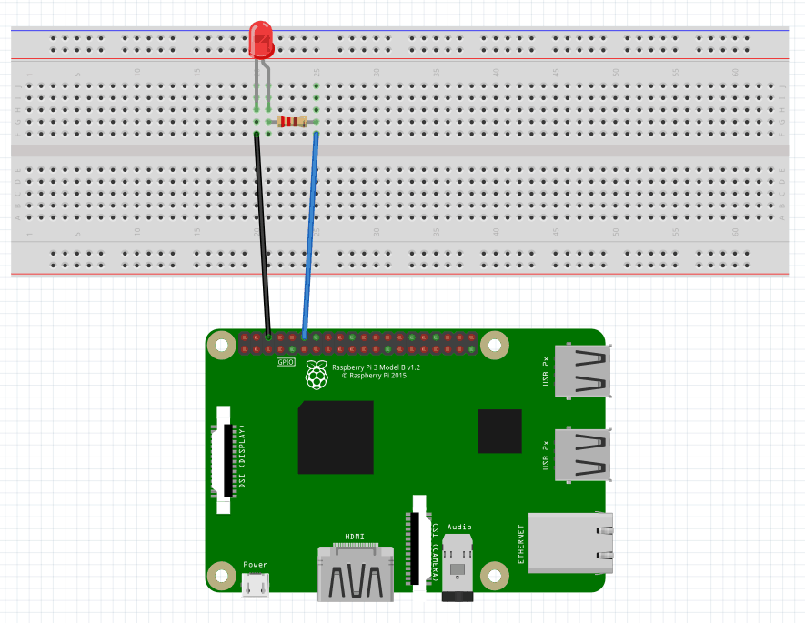
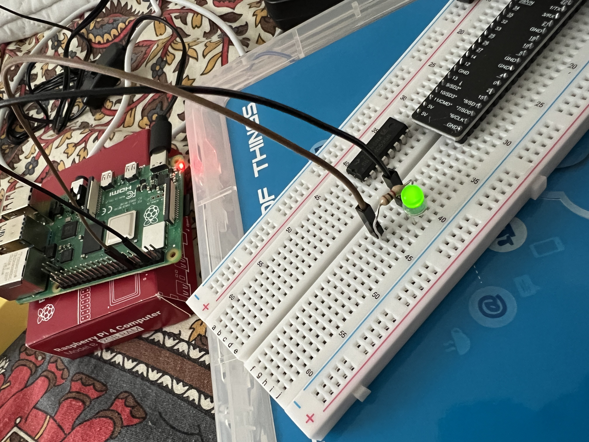

I had tried the following experiments on DHT11 sensors.
Hardware required:
1.	Breadboard with ESP32-Wrover
2.	Four jumper cables(the ones having pins at both ends)
3.	DHT11 sensor
4.	One 10 kiloohm resistor
5.	LED Light 

Software required:
1.	Arduino IDE

First Experiment: I tried to capture the temperature and humidity through Raspberry pie. The circuit diagram is as shown in figure.

 
 
Before starting the experiment, I have plugged all the pins of DTH11 sensor to the pie. I have also attached the circuit diagram picture.
1.	Firstly, I tried to use the python code for temperature and humidity recording . However iam unable to do that using python so I tried to do in the C.
2.	I have cloned the Wiring pi program from https://github.com/WiringPi/WiringPi.git. And installed it in the dietpi. I got some difficulty while performing cloning the Wiring Program.
3.	In the next step I have saved the c code using nano in dietpi (example.c is the code which I was saved) which was compiled and executed.
gcc -o example example.c -lwiringPi -lwiringPiDev

sudo ./example

I was able to get the recording but I got “data not good,skip” many times. I tried to comment those lines later then we can get only temperature and humidity recording. Please refer the screenshot where I can get only reading of temperature and humidity not data not good, skip. Thanks Susmitha for helping me to perform the experiment.

 

These are my references: 

https://www.circuitbasics.com/how-to-set-up-the-dht11-humidity-sensor-on-the-raspberry-pi/

Second Experiment: I tried to capture the temperature and humidity through my windows( Arduino).
Please find the circuit diagram as shown:

 

 

Before starting the experiment, I have plugged all the pins of DTH11 sensor to the ESP32 Wrover. I have also attached the circuit diagram picture. Special thanks to Sowmya as she posted the clear step in order to complete the experiment.
Downloaded and installed Arduino my windows. Using USB cable connected the ESP32 board to laptop. I have updated the addition URL in preferences. Downloaded the zip folder and included that zip folder in the Arduino. Later I copied the c code from the https://freenove.com/fnk0047/. I uploaded the code in .ino file. I have changed baud rate to 115200 in the serial monito. I can able to see the temperature and humidity reading.
Please find the below screenshots of my experiment.

 
 
 
Third Experiment:
I have plugged all the pins as per in the circuit diagram:

 

I have created file using nano with c code. After pasting the code in light1.c . I have excuted the below commands
$gcc light1.c-o bLed -lwiringPi
$sudo ./bLed
Late I could see the led Light blinking

 

 

