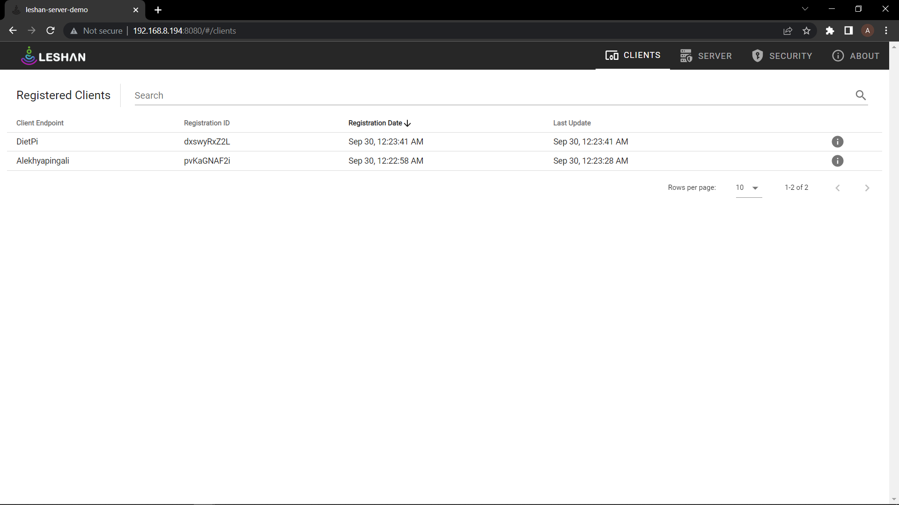
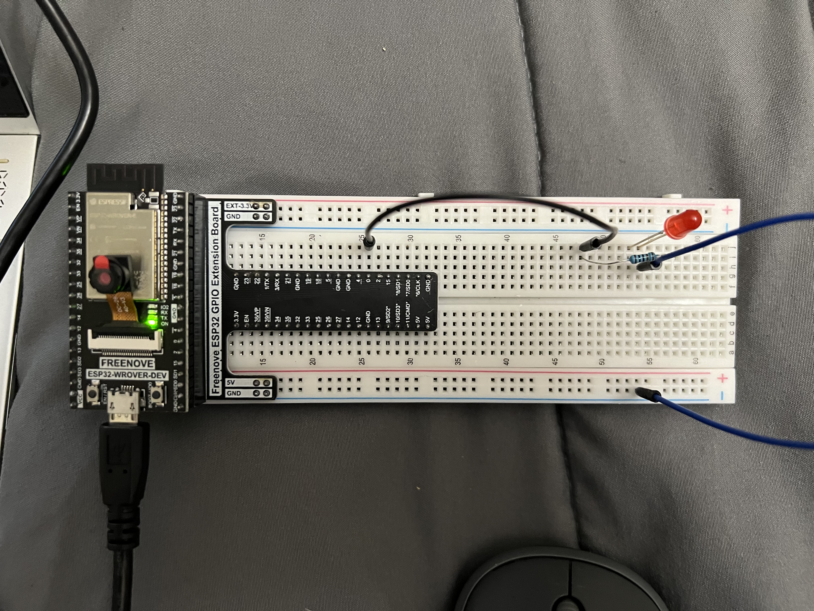

During class hours I have builded anjay client for my ESP32. Please find the below screenshot

Later I have done experiments on light control and push button with the help of Freenove C_Tutorial. Here are the steps to do light control experiment. I 
1.	Open the menu config as we have done during building of anjay client.
2.	Need to navigate to component  config.
3.	Select anjay-esp32-client.
4.	Select light control and is enabled.
5.	Need to navigate to light control options, enable the red light and entered the port number.
6.	Later I have saved and started building, flashing.
7.	I can able to see light control in the leshan server. I have experimented by switching OFF/ON and increase/ decrease the light intensity by using dimmer.
8.	Here are some of the screenshots and videos.
Problem Faced: I have used the blue color light instead of red in the first but I unable to get the results as expected. Later I have used the red color in which I Can able to see the results.

Please find the screenshot for circuit diagram for light control.

Please find the below video of light control circuit.

Here is the second experiment I have done on push button.
1.	Open the menu config as we have done during building of anjay client.
2.	Need to navigate to component  config.
3.	Select anjay-esp32-client.
4.	Select Push button and is enabled. Need to enter the port number here.

5.	Later I have saved and started building, flashing.
6.	I can able to see push button in the leshan server. At first the count be will be zero will be increased by pushing the button.
7.	Here are some of the screenshots 

Please find the screenshot for circuit diagram for push button control.

Screebshot before pushing the button.

Screebshot after pushing the button.

