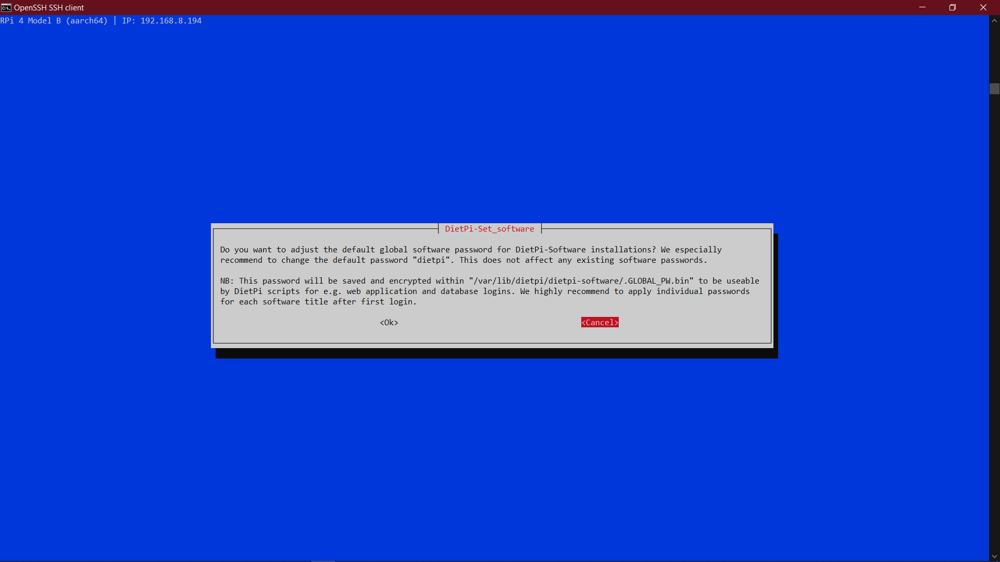

Setup your working environment on my laptop:

I have downloaded the following before coming to class:
1. 7 Zip as I have a windows laptop, I had issue with Breezip extractor.
2. BalenaEtcher
3. DietPI ARMv8 64-bit image using the download link:

https://dietpi.com/downloads/images/DietPi_RPi-ARMv8-Bullseye.7z

Download and configure DietPI on your laptop:

• I extracted the DietPi_RPi-ARMv8-Bullseye.7z using 7 zip.
• Using BalenaEtcher, I have scanned the downloaded DietPi image onto the SD card.
• Now we need to select the target and copy the image in Sd card
• A separate drive(E drive in my case) was accessible in my computer from which I could access the SD card contents. 

Configure the boot image on the microSD card of dietpi:

I copied the dietpi.txt and dietpi-wifi.txt to a separate location on my computer.
• I edited the dietpi-wifi.txt with my router SSID and credentials( as shown on the Wireless tab of the router’s admin panel)
• I edited the dietpi.txt with the location and wi-fi default settings. For the East coast US, the below variables need to be changed:
1. AUTO_SETUP_LOCALE=en_US.UTF-8
2. AUTO_SETUP_KEYBOARD_LAYOUT=us
3. AUTO_SETUP_TIMEZONE=America/New_York
4. AUTO_SETUP_NET_ETHERNET_ENABLED=0
5. AUTO_SETUP_NET_WIFI_ENABLED=1
6. AUTO_SETUP_NET_WIFI_COUNTRY_CODE=US
7. AUTO_SETUP_DHCP_TO_STATIC=1
8. AUTO_SETUP_NET_HOSTNAME=DietPi_{YOUR_INITIALS}
9. AUTO_SETUP_HEADLESS=1
10. AUTO_SETUP_AUTOSTART_TARGET_INDEX=1
11. SURVEY_OPTED_IN=0
12. CONFIG_SERIAL_CONSOLE_ENABLE=1

• Took the SD card out from my laptop.

Install SD card onto the PI and powerup the PI to run DietPI:

• Inserted the SD card into the Raspberry Pi and powered it up using the power cord provided with the PI. Red light was turned on and the green light started flashing. It flashed nearly for 10 minutes after which it stopped flashing.

Login to the DietPi using the wireless access point:

• Then I checked the Clients tab in my router’s admin panel. I could see a new device DietPi connected to the network. I copied its IP address.
• Used SSH to login into PI using the below command in my command prompt:

ssh root@IPADDR
password: dietpi (default password)

where, IPADDR is the IP address that I copied from Clients page.

Here are few screenshots of Dietpi Installing.

• The PI started installing a lot of updates for about 2-3 minutes after which it disconnected the ssh connection.

Dietpi installed. Here are some of the screenshots:

• I once again logged into the PI. This time I was able to change the default password for ‘root’ and ‘dietpi’ users.

Able to login to SSH and change the password.Here are few of the screenshots.

Challenges:

I was unable to burn the diet pi image in my laptop dont know the issue. With the help of my friend susmitha i have burned the image and copied
the image in the sd card in her laptop and later I flashed in her laptop. After flashing i took the SD card and placed in my laptop for further changes.

