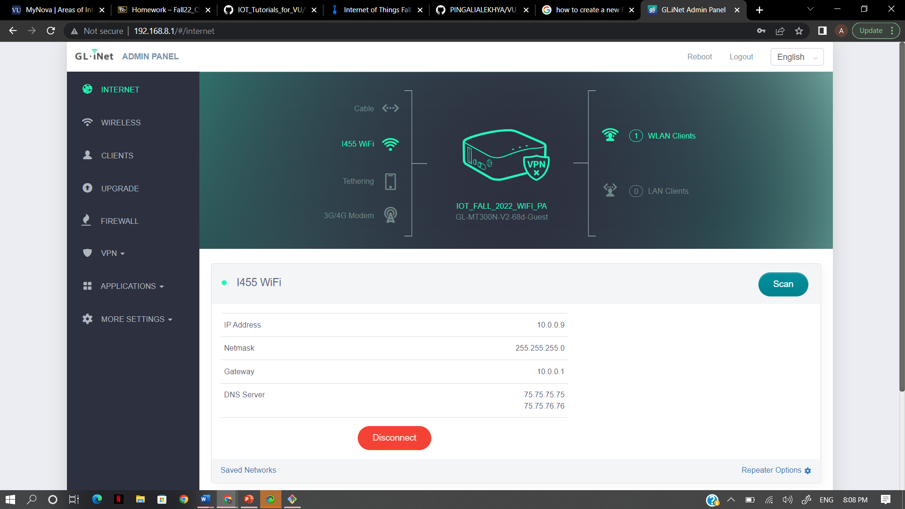

Steps describing how to setup the router:

1. Plug in the cable to the router and switchbox. After powerup, mini router will broadcast some random WIFI signal such as GL-MT300N-V2-XXX in my case.
2. Connect to the WIFI with default WIFI password.
3. Now we can able to connect and there will be no internet provided
4. Visit http://192.168.8.1 in browser.
5. login into Admin details with passwords.
6. Enter the wireless and updated the wifi name with IOT_FALL_2022_WIFI_PA and password.
7. Now the internet will be disconnected and again will need to connect again with updated Wifi name.
8. You need to eneter internet and need to set up the router.
9. Scan it and login through the home wifi with credentials.
10. Success popup will be displayed and able to access the network.Please find the image attached.

